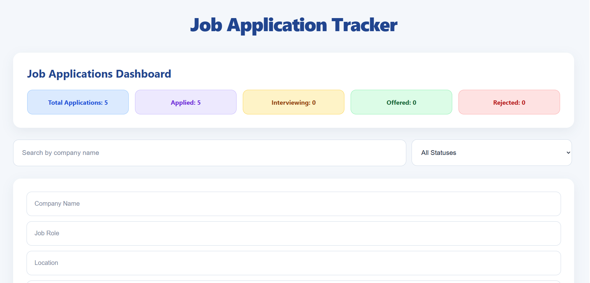
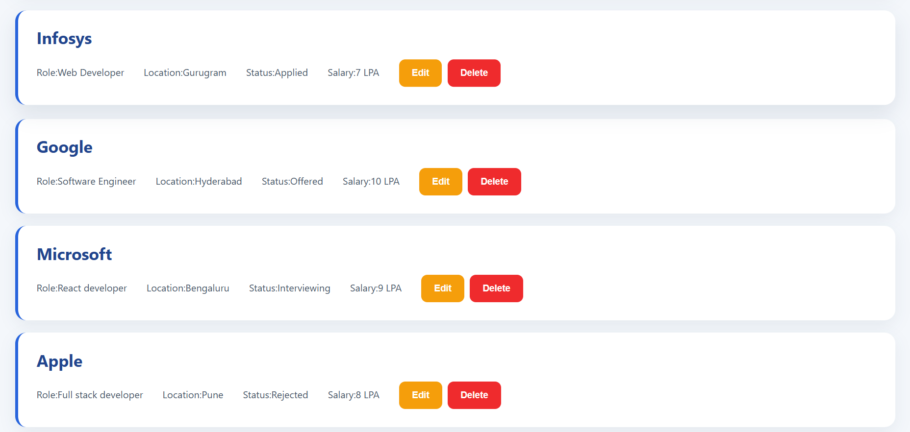

# Job Application Tracker

A full-stack web application to organize and track job applications in one place. Built with React.js, Node.js, Express.js, MySQL, and Sequelize.

## Overview

The Job Application Tracker helps users manage job application details and keep track of their application progress through a simple web interface.

The project includes a React frontend, a Node.js and Express REST API, and a MySQL database managed using Sequelize ORM.

## Features

* **Add Jobs:** Save job application details.
* **Edit Jobs:** Update existing application information.
* **Delete Jobs:** Remove job applications.
* **Search Jobs:** Find applications using the search functionality.
* **Filter by Status:** Filter applications according to their current status.
* **Track Progress:** Manage statuses such as Applied, Interviewing, Offered, and Rejected.

## Tech Stack

| Technology   | Purpose                                 |
| ------------ | --------------------------------------- |
| React.js     | Frontend user interface                 |
| JavaScript   | Application logic                       |
| CSS          | Styling and layout                      |
| Axios        | HTTP requests from the frontend         |
| Node.js      | Backend runtime                         |
| Express.js   | REST API and server                     |
| MySQL        | Relational database                     |
| Sequelize    | ORM for database operations             |
| Git & GitHub | Version control and source code hosting |

## Project Structure

```text
job-application-tracker/
├── backend/
│   ├── config/
│   │   └── database.js
│   ├── controllers/
│   │   └── jobController.js
│   ├── models/
│   │   └── Job.js
│   ├── routes/
│   │   └── jobRoutes.js
│   ├── package.json
│   └── server.js
├── frontend/
│   ├── public/
│   ├── src/
│   │   ├── App.jsx
│   │   ├── App.css
│   │   ├── index.css
│   │   └── main.jsx
│   └── package.json
├── .gitignore
└── README.md
```

## Getting Started

### Prerequisites

Install the following before running the application:

* Node.js and npm
* MySQL Server
* Git

### 1. Clone the Repository

```bash
git clone https://github.com/pragatiswami421/job-application-tracker.git
cd job-application-tracker
```

### 2. Set Up the Database

Start MySQL and create a database for the application.

```sql
CREATE DATABASE job_application_tracker;
```

Use the database name and connection settings expected by your backend configuration.

### 3. Configure Environment Variables

Create a `.env` file inside the `backend/` directory if your backend uses environment variables.

Example template (adjust variable names to match `backend/config/database.js` and `backend/server.js`):

```env
PORT=5000
DB_HOST=localhost
DB_PORT=3306
DB_NAME=job_tracker
DB_USER=your_mysql_username
DB_PASSWORD=your_mysql_password
```

**Security:** Replace the example values with your local settings. Never commit your real `.env` file, database password, or other secrets to GitHub.

### 4. Install Backend Dependencies

```bash
cd backend
npm install
```

### 5. Start the Backend

Run the script configured in `backend/package.json`. For example, if a `start` script exists:

```bash
npm start
```

If your project uses a different script, use the command defined in your `package.json`.

### 6. Install and Start the Frontend

Open a second terminal in the project root and run:

```bash
cd frontend
npm install
npm run dev
```

Open the local URL displayed by Vite in your browser.

## API Documentation

The following endpoint pattern is intended for the job CRUD API. Confirm the exact paths in `backend/routes/jobRoutes.js` before relying on this table.

| Method | Endpoint        | Purpose                   |
| ------ | --------------- | ------------------------- |
| GET    | `/api/jobs`     | Retrieve job applications |
| POST   | `/api/jobs`     | Create a job application  |
| PUT    | `/api/jobs/:id` | Update a job application  |
| DELETE | `/api/jobs/:id` | Delete a job application  |

### Example Job Statuses

* Applied
* Interviewing
* Offered
* Rejected

Use only the status values defined by the backend model.


## Screenshots

### Job Application Tracker Dashboard



### Job Application List




## Author

**Pragati Swami**

GitHub: [@pragatiswami421](https://github.com/pragatiswami421)

---


